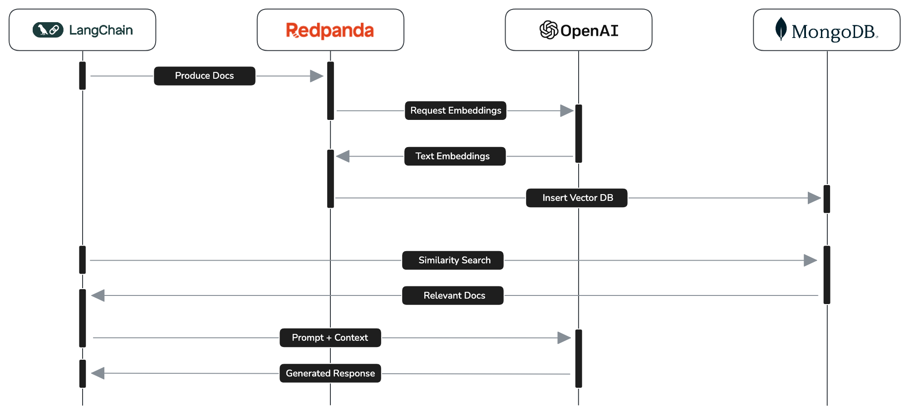

> [!NOTE]
> This repository supplements the Medium story: [Streaming Text Embeddings for Retrieval Augmented Generation (RAG)](https://medium.com/@jameskinley/streaming-text-embeddings-for-retrieval-augmented-generation-rag-95da9249a548)

# Streaming Text Embeddings for Retrieval Augmented Generation (RAG)

How to use Redpanda and Redpanda Connect to generate vector embeddings on streaming text.

<p align="center">
    
</p>

Retrieval Augmented Generation (RAG) is best described by [OpenAI](https://help.openai.com/en/articles/8868588-retrieval-augmented-generation-rag-and-semantic-search-for-gpts) as _"the process of retrieving relevant contextual information from a data source and passing that information to a large language model alongside the user's prompt. This information is used to improve the model's output by augmenting the model's base knowledge"._

RAG comprises of two parts:

1. The acquisition and persistence of new information that the model has no prior knowledge of. This new information (documents, webpages, etc) is split into small chunks of text and stored in a vector database along with its vector embeddings. This is the bit we're going to do in near realtime using Redpanda.

> [!NOTE]
> Vector embeddings are a mathematical representation of text that encode its semantic meaning in a vector space. Words with a similar meaning will be clustered closer together in this multidimensional space. Vector databases, such as [MongoDB Atlas](https://www.mongodb.com/products/platform/atlas-vector-search), have the ability to query vector embeddings to retrieve texts with a similar semantic meaning. A famous example of this being: `king - man + woman = queen`.

2. The retrieval of relevant contextual information from a vector database (semantic search), and the passing of that information alongside a user's question (prompt) to the large language model to improve the model's generated answer.

In this demo, we'll demonstrate how to build a stream processing pipeline using the Redpanda Platform to add [OpenAI text embeddings](https://platform.openai.com/docs/guides/embeddings) to messages as they stream through Redpanda on their way to a MongoDB Atlas vector database. As part of the solution we'll also use the [LangChain](https://www.langchain.com/) framework to acquire and send new information to Redpanda, and to build the prompt that retrieves relevant texts from the vector database and uses that context to query OpenAI's `gpt-4o` model.


## Prerequisites

Complete the setup [prerequisites](./docs/prerequisites.md) to prepare a local `.env` file that contains connection details for Redpanda Cloud, OpenAI, and MongoDB Atlas. The environment variables included in the `.env` file are used in this demo by the Python scripts and by Redpanda Connect for configuration interpolation:

```bash
export $(grep -v '^#' .env | xargs)
```

### Create Python virtual environment

```bash
python3 -m venv env
source env/bin/activate
pip install -r requirements.txt
```

### Install rpk

See: https://docs.redpanda.com/redpanda-connect/guides/getting_started/#install


## Run the demo

The demo comprises of four parts:

### 1. Ask a question

Ask OpenAI's `gpt-4o` model to answer a question about something that happended after it's training cutoff date of October 2023 (i.e. something it hasn't learned about).

```bash
# Activate the Python environment
source env/bin/activate

# Prompt OpenAI without any context
python openai_rag.py -v -q "Name the atheletes and their nations that won Gold, Silver, and Bronze in the mens 100m at the Paris olympic games."

# gpt-4o doesn't know the answer
Question: Name the atheletes and their nations that won Gold, Silver, and Bronze in the mens 100m at the Paris olympic games.
  Answer: I don't know.
```

### 2. Start the Redpanda Connect pipeline

Run a Redpanda Connect pipeline that consumes messages from a Redpanda topics named `documents`, and passes each message to OpenAI's embeddings API to retrieve the vector embeddings for the text. The pipeline then inserts the enriched messages into a MongoDB Atlas database collection that has a vector search index.

```bash
rpk connect run --log.level debug openai_rpcn.yaml

INFO Running main config from specified file       @service=redpanda-connect benthos_version=4.34.0 path=openai_rpcn.yaml
INFO Listening for HTTP requests at: http://0.0.0.0:4195  @service=redpanda-connect
INFO Launching a Redpanda Connect instance, use CTRL+C to close  @service=redpanda-connect
INFO Input type kafka is now active                @service=redpanda-connect label="" path=root.input
DEBU Starting consumer group                       @service=redpanda-connect label="" path=root.input
INFO Output type mongodb is now active             @service=redpanda-connect label="" path=root.output
DEBU Consuming messages from topic 'documents' partition '0'  @service=redpanda-connect label="" path=root.input
```

### 3. Produce new text documents

Download some relevant information from a reputable source, like the BBC website. Split the text into smaller parts using LangChain, and send the splits to the `documents` topic.

```bash
python produce_documents.py -u https://www.bbc.co.uk/sport/olympics/articles/clwyy8jwp2go
```

At this point the messages will be picked up by the Redpanda Connct pipeline, enriched with vector embeddings, and inserted into MongoDB ready for searching.

### 4. Ask the question again

To complete the RAG demo, use LangChain to retrieve the information stored in MongoDB by performing a similarity search. The context is added to a prompt that asks OpenAI the same question from the first step. The `gpt-4o` model is now able to use the additional context to generate a better response to the original question.

```bash
python openai_rag.py -v -q "Name the atheletes and their nations that won Gold, Silver, and Bronze in the mens 100m at the Paris olympic games."

Question: Name the atheletes and their nations that won Gold, Silver, and Bronze in the mens 100m at the Paris olympic games.
  Answer: The athletes who won medals in the men's 100m at the Paris Olympic Games are:

          - Gold: Noah Lyles (USA)
          - Silver: Kishane Thompson (Jamaica)
          - Bronze: Fred Kerley (USA)
```
